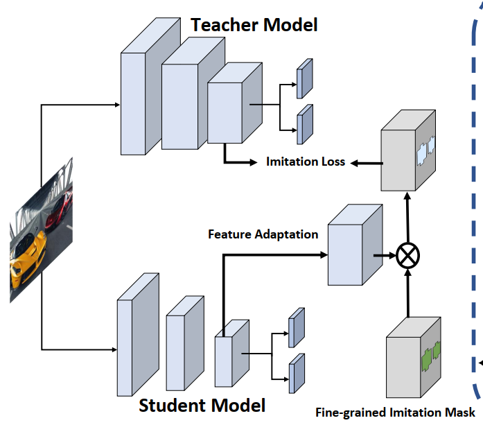
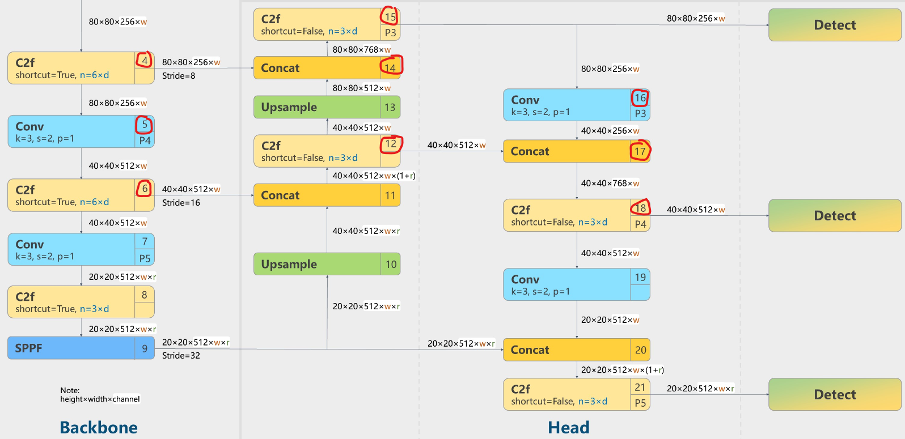

# [YOLOv8 KD ver1](yolov8_KD/KD_training.py) 
KD sử dụng feature map



Sử dụng imitation mask để upscale feature của student sao cho khớp với feature size của teacher

## 1. Trích xuất đặc trưng từ các đầu ra layer cụ thể
```
DetectionModel(
  (model): Sequential(
    (0): Conv(
      (conv): Conv2d(3, 48, kernel_size=(3, 3), stride=(2, 2), padding=(1, 1), bias=False)
      (bn): BatchNorm2d(48, eps=0.001, momentum=0.03, affine=True, track_running_stats=True)
      (act): ReLU(inplace=True)
    )
    (1): Conv(
      (conv): Conv2d(48, 96, kernel_size=(3, 3), stride=(2, 2), padding=(1, 1), bias=False)
      (bn): BatchNorm2d(96, eps=0.001, momentum=0.03, affine=True, track_running_stats=True)
      (act): ReLU(inplace=True)
    )
    (2): C2f(
      (cv1): Conv(
        (conv): Conv2d(96, 96, kernel_size=(1, 1), stride=(1, 1), bias=False)
        (bn): BatchNorm2d(96, eps=0.001, momentum=0.03, affine=True, track_running_stats=True)
        (act): ReLU(inplace=True)
      )
      (cv2): Conv(
        (conv): Conv2d(192, 96, kernel_size=(1, 1), stride=(1, 1), bias=False)
        (bn): BatchNorm2d(96, eps=0.001, momentum=0.03, affine=True, track_running_stats=True)
        (act): ReLU(inplace=True)
      )
      (m): ModuleList(
        (0-1): 2 x Bottleneck(
          (cv1): Conv(
            (conv): Conv2d(48, 48, kernel_size=(3, 3), stride=(1, 1), padding=(1, 1), bias=False)
            (bn): BatchNorm2d(48, eps=0.001, momentum=0.03, affine=True, track_running_stats=True)
            (act): ReLU(inplace=True)
          )
          (cv2): Conv(
            (conv): Conv2d(48, 48, kernel_size=(3, 3), stride=(1, 1), padding=(1, 1), bias=False)
            (bn): BatchNorm2d(48, eps=0.001, momentum=0.03, affine=True, track_running_stats=True)
            (act): ReLU(inplace=True)
          )
        )
      )
    )
    (3): Conv(
      (conv): Conv2d(96, 192, kernel_size=(3, 3), stride=(2, 2), padding=(1, 1), bias=False)
      (bn): BatchNorm2d(192, eps=0.001, momentum=0.03, affine=True, track_running_stats=True)
      (act): ReLU(inplace=True)
    )
    (4): C2f(
      (cv1): Conv(
        (conv): Conv2d(192, 192, kernel_size=(1, 1), stride=(1, 1), bias=False)
        (bn): BatchNorm2d(192, eps=0.001, momentum=0.03, affine=True, track_running_stats=True)
        (act): ReLU(inplace=True)
      )
      (cv2): Conv(
        (conv): Conv2d(576, 192, kernel_size=(1, 1), stride=(1, 1), bias=False)
        (bn): BatchNorm2d(192, eps=0.001, momentum=0.03, affine=True, track_running_stats=True)
        (act): ReLU(inplace=True)
      )
      (m): ModuleList(
        (0-3): 4 x Bottleneck(
          (cv1): Conv(
            (conv): Conv2d(96, 96, kernel_size=(3, 3), stride=(1, 1), padding=(1, 1), bias=False)
            (bn): BatchNorm2d(96, eps=0.001, momentum=0.03, affine=True, track_running_stats=True)
            (act): ReLU(inplace=True)
          )
          (cv2): Conv(
            (conv): Conv2d(96, 96, kernel_size=(3, 3), stride=(1, 1), padding=(1, 1), bias=False)
            (bn): BatchNorm2d(96, eps=0.001, momentum=0.03, affine=True, track_running_stats=True)
            (act): ReLU(inplace=True)
          )
        )
      )
    )
    ...
```

Dựa vào các id của các block (1, 2, 3, ...), ta trích xuất các feature map từ các đầu ra của các layer đó.



## 2. Implement
* Định nghĩa lại các hàm train của các đổi tượng liên quan ```train_v2(self: YOLO,  **kwargs), trainer_train_v2(self: BaseTrainer), _do_train_v2(self: BaseTrainer, world_size=1)```
* Thêm teacher vào trainer
    ```python
    if kwargs.get('teacher'):
        self.trainer.teacher = YOLO(kwargs['teacher']).model.to(self.trainer.device)
    ```
* Tạo imitation mask cho các feature map của các layer chỉ định cần up scale
    ```python
    if hasattr(self, 'teacher'):
            dump_image = torch.zeros((1, 3, self.args.imgsz, self.args.imgsz), device=self.device)

            _, features = self.model(dump_image, mask_id = mask_id)  # forward
            _, teacher_feature= self.teacher(dump_image, mask_id = mask_id) 
            
            stu_feature_adapts = [] # contain imitation

            for i in range(len(features)):
                _, student_channel, student_out_size, _ = features[i].shape
                _, teacher_channel, teacher_out_size, _ = teacher_feature[i].shape
                stu_feature_adapts.append(nn.Sequential(nn.Conv2d(student_channel, teacher_channel, 3, 
                                                        padding=1, stride=int(student_out_size / teacher_out_size)), 
                                                        nn.ReLU()).to(self.device)) # imitation mask
    ```

* KD loss: ```nn.MSELoss``` được dùng để tính loss của các feature map được KD. KD loss được điều chỉnh trọng số tuỳ biến

* Các tham số quan trọng
    ```python
    parser.add_argument('--model', default='yolov8m.yaml', help='Pretrained pruning target model file')
    parser.add_argument('--teacher', help='teacher model')
    parser.add_argument('--kd_layer', nargs='*', type=int, default=[15, 18, 21], help="id of layers for KD")

    parser.add_argument('--batch', default=4, type=int, help='batch_size')
    parser.add_argument('--data', default='coco128.yaml', help='dataset')
    parser.add_argument('--device', default=0, help='cpu or gpu')
    parser.add_argument('--project', default='KD', help='project name')
    parser.add_argument('--epochs', type=int, default=10, help='epochs')
    parser.add_argument('--imgsz', type=int, default=640, help='Size of input images')
    parser.add_argument('--workers', type=int, default=4, help="number of worker threads for data loading (per RANK if DDP)")
    parser.add_argument('--resume', type=bool, default=False, help="continue training (if KD, must provide teacher)")
    ```

# [YOLOv8 KD ver2](yolov8_KD/KD_training_ver2.py) 
KD sử dụng output của mô hình

## 1. Output của yolov8 
Output của YOLOv8 là 3 output của Detect layer với kích thước ```[b, a, c1, c2]```. Trong đó,  ```a``` là chiều lưu ouput logit của các bbox và class_score của feature map. Các box và class_score logit được đưa qua các hàm softmax và sigmoid tương ứng để tạo bbox là class_score. Do đó, khi tính KD loss ta có thể dùng ```torch.nn.KLDivLoss```

## 2. Tính KD loss
```python
def cal_kd_loss(self: BaseTrainer, student_preds, teacher_preds, T=3):
    m = self.model.model[-1]
    nc = m.nc  # number of classes
    no = m.no  # number of outputs per anchor
    reg_max = m.reg_max
 
    stu_pred_distri, stu_pred_scores = torch.cat([xi.view(student_preds[0].shape[0], no, -1) for xi in student_preds], 2).split(
            (reg_max * 4, nc), 1)

    stu_pred_scores = stu_pred_scores.permute(0, 2, 1).contiguous() # batch, anchors, channels
    stu_pred_distri = stu_pred_distri.permute(0, 2, 1).contiguous() # batch, anchors, channels
    b, a, c = stu_pred_distri.shape  # batch, anchors, channels

    tea_pred_distri, tea_pred_scores = torch.cat([xi.view(teacher_preds[0].shape[0], no, -1) for xi in student_preds], 2).split(
            (reg_max * 4, nc), 1)

    tea_pred_scores = tea_pred_scores.permute(0, 2, 1).contiguous() # batch, anchors, channels
    tea_pred_distri = tea_pred_distri.permute(0, 2, 1).contiguous() # batch, anchors, channels
    #-------------------------------KD loss----------------------------------------
    kl_loss = nn.KLDivLoss(reduction="mean")

    stu_pred_scores = (stu_pred_scores/T).sigmoid()
    stu_pred_distri = (stu_pred_distri/T).view(b, a, 4, c // 4).softmax(3)

    tea_pred_scores = (tea_pred_scores/T).sigmoid()
    tea_pred_distri = (tea_pred_distri/T).view(b, a, 4, c // 4).softmax(3)

    cl_loss = kl_loss(stu_pred_scores, tea_pred_scores)
    box_loss = kl_loss(stu_pred_distri, tea_pred_distri)

    return 0.8*box_loss + 0.2*cl_loss
```
